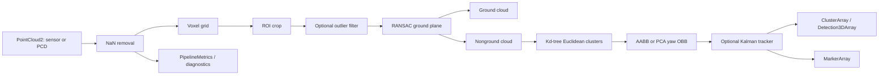

# Architecture

The workspace deliberately separates wire contracts from implementation:

- `lidar_perception_msgs` owns stable cluster and metric messages.
- `lidar_perception` owns the reusable C++ algorithm library and ROS nodes.

## Components

`Processor` is ROS-independent. It accepts `pcl::PointCloud<pcl::PointXYZI>` and
returns stage clouds, object geometry, and counts. This boundary keeps algorithm
tests deterministic and makes a future component-node or accelerator backend
straightforward.

`PerceptionNode` converts `sensor_msgs/PointCloud2`, owns parameter validation,
publishes products, and emits both standard `/diagnostics` status and a typed
per-frame metrics stream. Sensor-data QoS is used for point clouds; object and
metric products use reliable depth-10 queues.

`MultiObjectTracker` uses one constant-velocity `[x, y, vx, vy]` Kalman filter
per track. Greedy globally sorted nearest-neighbor pairs are distance-gated.
Tentative tracks require `min_hits`; stale tracks survive `max_misses` frames.

`SyntheticCloudPublisher` generates a seeded ground plane, three differently
sized cuboids, sparse outliers, and one moving object. `PcdPlaybackNode` loads a
single `.pcd` or a lexically sorted directory and stamps frames at publication.

## Runtime interfaces

| Topic | Type | Meaning |
|---|---|---|
| `/points_raw` | `sensor_msgs/PointCloud2` | Default input |
| `~/filtered` | `sensor_msgs/PointCloud2` | ROI/downsampled/denoised input |
| `~/ground` | `sensor_msgs/PointCloud2` | RANSAC plane inliers |
| `~/nonground` | `sensor_msgs/PointCloud2` | Obstacle candidates |
| `~/clusters` | `lidar_perception_msgs/ClusterArray` | Geometry, velocity, IDs |
| `~/detections` | `vision_msgs/Detection3DArray` | Ecosystem-compatible 3D boxes |
| `~/markers` | `visualization_msgs/MarkerArray` | RViz boxes and labels |
| `~/metrics` | `lidar_perception_msgs/PipelineMetrics` | Per-frame telemetry |
| `/diagnostics` | `diagnostic_msgs/DiagnosticArray` | Standard health reporting |

The pipeline assumes the incoming cloud is already expressed in the desired
processing frame. It preserves the input header on every output and does not
perform a TF transform, avoiding hidden temporal extrapolation. Integrators
requiring a base-frame ROI should transform upstream with `tf2` at the cloud
timestamp.

## Failure behavior

Invalid startup parameters fail construction. Invalid runtime updates are
rejected atomically. A valid runtime algorithm/tracker update rebuilds both
objects and intentionally resets tracker state. Frame conversion/processing
exceptions are throttled and raise diagnostic status to `ERROR`; waiting for
the first cloud is `WARN`.
