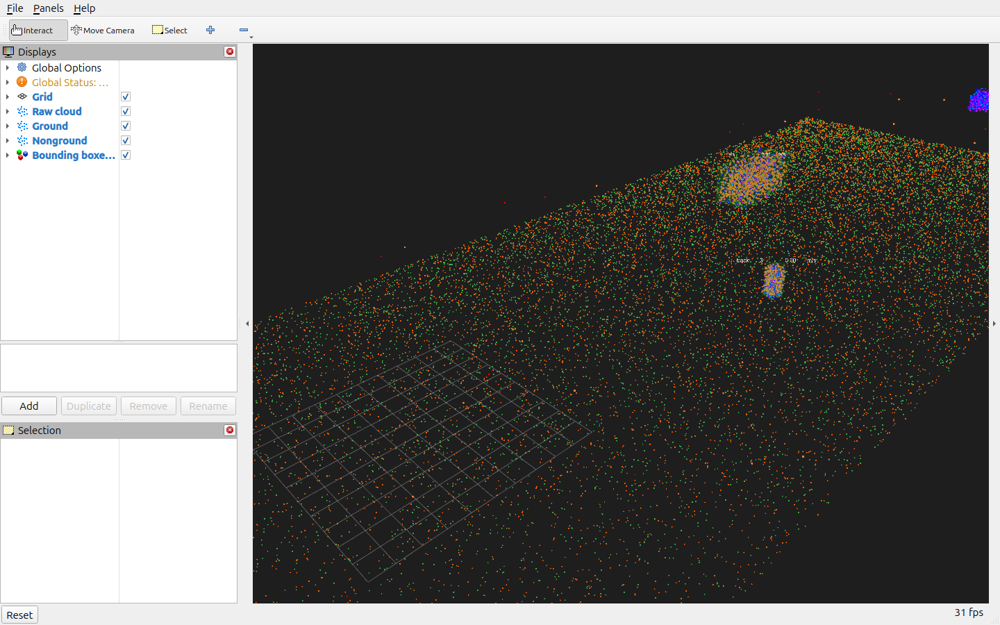

# Validation evidence

This evidence was generated locally on 2026-09-18 from the repository build,
not estimated or copied from another system.



The screenshot is the supplied RViz configuration connected to the seeded
synthetic publisher and perception node. Green points are RANSAC ground,
orange points are nonground, and translucent boxes/labels are confirmed tracks.

## Synthetic benchmark

Command:

```bash
ROS_DOMAIN_ID=89 ros2 run lidar_perception run_benchmark.py \
  --warmup 2 --duration 10 --build-type RelWithDebInfo \
  --output docs/evidence/synthetic_benchmark.json
```

Observed after warm-up on an AMD Ryzen 9 8940HX (32 logical CPUs), ROS 2 Jazzy,
Fast DDS, and a `RelWithDebInfo` build:

| Measure | Observed value |
|---|---:|
| Samples | 102 |
| Callback latency, mean | 13.178 ms |
| Callback latency, p95 | 14.107 ms |
| Observed callback/workload rate, mean | 10.003 Hz |
| Point reduction, mean | 6.744% |
| Clusters per frame | 3.0 |
| Confirmed tracks per frame | 3.0 |
| Adjacent-frame track-ID retention | 1.0 |

The rate above reflects callback completions under the configured 10 Hz input;
it is not a maximum-throughput result. These measurements apply only to this
seeded synthetic workload, host, middleware, parameters, and build. They are not
generalized sensor, dataset, or hardware performance claims. The complete
machine-readable distributions and provenance are in
[`synthetic_benchmark.json`](synthetic_benchmark.json).

## Build, tests, and lint

Before this audit, `colcon test-result --all --verbose` reported **52
test-result entries, 0 errors, 0 failures, and 10 skipped**. That count was
accurate for the configured suite, but the CMake configuration suppressed the
standard copyright linter. The audit corrected four Python MIT headers and
enabled that linter.

The final clean ROS 2 Jazzy build reports **67 test-result entries, 0 errors, 0
failures, and 10 skipped**. The added copyright report contains 14 passing
entries. These totals include aggregate CTest reporting and should not be
interpreted as independent test-case counts.

All 10 remaining skips are cppcheck entries. ROS 2 Jazzy's installed
`ament_cppcheck`
intentionally disables cppcheck 2.13 because that version has known performance
problems. A separate forced cppcheck run over the production `include` and `src`
trees reported no problems. Forcing the test tree additionally produces only
GTest-macro parser false positives. No source defect is hidden by these skips,
and overriding the Jazzy safeguard in CI is not required.
